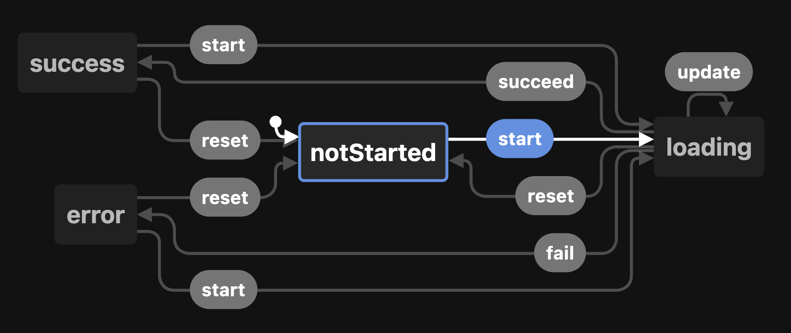

<center style="max-width: 500px; margin: 0 auto;">

# rxjs-loading-state

[](https://app.circleci.com/pipelines/github/tomraithel/rxjs-loading-state)

**rxjs-loading-state** eliminates manual state management for loading and error states by transforming `Observables` into a `LoadingState`.

</center>

## Table of contents:

- [Getting Started](#getting-started)
  - [Installation](#installation)
  - [TL;DR](#tldr)
  - [What is a LoadingStateMachine?](#what-is-a-loading-state)
  - [trackLoadingBy operator explained](#trackLoadingBy-operator)
- [API](#api)
  - [LoadingStateMachine](#loading-state)

## <a name="getting-started"></a> Getting started

### <a name="installation"></a> How to install?

Installation via NPM:

```bash
npm install rxjs-loading-state --save
```

### <a name="tldr"></a> TL;DR

You create a `LoadingStateMachine` object and connect it to your observable. This object now reflects the loading state of your Observable:

```ts
// Create a new LoadingStateMachine instance
const machine = new LoadingStateMachine<number>();

// Create an Observable that finishes after 1000ms and track it by the machine
const loadData$ = of(42).pipe(delay(1000), trackLoadingBy(machine));

// As long as no one is subscribed, loading state is in "notStarted" state
console.log(machine.state); // "notStarted"

// After subscription, loading state transitions to "loading" state
loadData$.subscribe();
console.log(machine.state); // "loading"

// After 2s the Observable is completed and loadingState transitioned to "success"
setTimeout(() => {
  console.log(machine.state); // "success"
}, 2000);
```

### <a name="what-is-a-loading-state"></a> What is a `LoadingStateMachine`?

The `LoadingStateMachine` is a small state-machine that consists of four states it can be in:

| Type                          | Description                                                  |
| ----------------------------- | ------------------------------------------------------------ |
| `LoadingStateName.NotStarted` | Loading has not been started yet.                            |
| `LoadingStateName.Loading`    | Data is getting loaded. Could be the first load or a reload. |
| `LoadingStateName.Error`      | An error occurred during loading.                            |
| `LoadingStateName.Success`    | Data has successfully been loaded.                           |

Transition between these steps can be performed with event methods. This state-chart gives an overview, which event can be called in which state.



> Note: If an event is triggered in an invalid state, the state machine rises an exception!

```typescript
const machine = new LoadingStateMachine<string>();

machine.start();
console.log(machine.state); // "loading"
console.log(machine.data); // undefined

machine.succeed("my-data");
console.log(machine.state); // "success"
console.log(machine.data); // "my-data"

machine.succeed("boo"); // throws IllegalStateTransitionError: Transition from success to success not allowed
```

### <a name="trackLoadingBy-operator"></a> The `trackLoadingBy` explained

Although you can manually trigger state changes on a `LoadingStateMachine`, there is a better way to do it.

The `trackLoadingBy` operator connects your state machine to an existing Observable. As soon as a subscription to this Observable starts, the `LoadingStateMachine` instance gets updated automatically and can be used in your view template.

```typescript
const machine = new LoadingStateMachine();
fetchData().pipe(trackLoadingBy(machine)).subscribe();

// later in your render-loop or template
function render() {
  if (machine.isLoading()) {
    return "loading...";
  }

  if (machine.isError()) {
    return "error: " + machine.error.message;
  }

  if (machine.isSuccess()) {
    return "data fetched: " + machine.data;
  }
}
```

## <a name="api"></a> API

TODO

<!--  JSDOC START -->

<!--  JSDOC END -->

<!-- State machine code -> https://stately.ai/viz

import { createMachine, assign } from 'xstate';


const fetchMachine = createMachine<Context>({
  id: "LoadingState",
  initial: "notStarted",
  states: {
    notStarted: {
      on: {
        start: "loading",
      },
    },
    loading: {
      on: {
        update: "loading",
        succeed: "success",
        reset: "notStarted",
        fail: "error",
      },
    },
    success: {
      on: {
        reset: "notStarted",
        start: "loading",
      },
    },
    error: {
      on: {
        reset: "notStarted",
        start: "loading",
      },
    },
  },
});
```
-->
